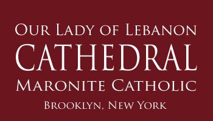
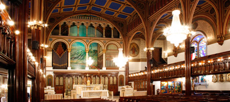
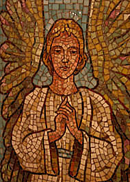

 Our Lady of Lebanon Maronite Cathedral - Brooklyn, N.Y. 

var addthis\_config = {"data\_track\_clickback":true};

[Share](http://www.addthis.com/bookmark.php?v=250&username=ololc) |

[SITE MAP](sitemap.html) | [CONTACT US](contact.html)

<!-- .style4 {font-family: Arial, Helvetica, sans-serif; font-size: 13px; } -->

[HOME](/index.html)

[ABOUT US](/about.html)

[DIRECTIONS](/directions.html)

[MINISTRIES](/ministries.html)

[MYSTERIES](/mysteries.html)

[ORGANIZATIONS](/organizations.html)

[MEDIA](/media.html)

[SUPPORT](/support.html)

[LINKS](/links.html)

Media & Publications
--------------------

**Bulletins**

[Jan 27 – Third Sunday after the Epiphany](doc/190127-bulletin.pdf)

[Jan 20 – Second Sunday after the Epiphany](doc/190120-bulletin.pdf)

[Jan 13 – First Sunday after the Epiphany](doc/190113-bulletin.pdf)

[Jan 6 – Feast of the Glorious Epiphany](doc/190106-bulletin.pdf)

[Dec 30 – The Finding of Our Lord in the Temple Sunday](doc/181230-bulletin.pdf)

**Support**

[Gift of the Heart](doc/Gift%20of%20the%20Heart%20Form1.pdf)

[Capital Campaign Brochure](doc/CapitalCampaign2011.pdf)

[Pledge Form](doc/PledgeForm2011.pdf)

[Commemorative Gifts](doc/CommemorativeGiftsBRO.pdf)

[Join the Order of St. Sharbel](doc/OSS%20Seminarian%20Poster%202018%20Brooklyn_letter.pdf)

**Events**

[93rd Annual St. Maron Luncheon, Feb 10, 2019](doc/2019%20St%20Maron's%20Invitation.pdf)

[Pilgrimage to Italy, May 1-10, 2019](doc/Pilgrimage%202019%20amended.pdf)

[Pilgrimage to the National Shrine and Basilica  
of Our Lady of Lebanon; yearly, mid-August](http://www.ourladyoflebanonshrine.com/index.php/pages/assumption-pilgrimage)

**Maronite Christian Formation (MCF)**

[Registration form](doc/2018-2019-OLOLC-RegistrationForm.pdf)

**Catholic Moral Ethics**

[Cedar of Lebanon Fertitlitycare™ Center](http://www.cedaroflebanonfcc.com)

Discover what every couple needs to know and every women has the right to know. Keep SPICE in your Marriage; learn that the gift of sexuality is multidimensional; and appreciate fertility rights.

**OLOLC Past Events**

[Homily of Patriarch Bechara Peter Cardinal Rai at  
Our Lady of Lebanon Cathedral – October 29, 2017](doc/171029-patriach-sermon.pdf)

[Procession at Shrine](https://drive.google.com/file/d/0B-ELQkxw7oPXOUJpZmx0YWtXZEk/view?usp=drive_web)

[2016 Shrine procession, clip 2](https://drive.google.com/file/d/0B-ELQkxw7oPXSUR2LXpvVEZsUU0/view?usp=drive_web)

[Divine Liturgy at Shrine](https://drive.google.com/file/d/0B-ELQkxw7oPXU0ZBaEZsemVxcVk/view?usp=drive_web)

**OLOLC on YouTube**

[NET TV – City of Churches – Our Lady of Lebanon Maronite Cathedral](https://www.youtube.com/watch?v=8Zldb8aLchA)

<!-- .style1 { font-family: Arial, Helvetica, sans-serif; font-size: 13px; color: #ECE9D8; } -->

© Our Lady of Lebanon Maronite Catholic Cathedral   •  113 Remsen Street, Brooklyn, NY 11201  
Tel: 718.624.7228  •  Email: CathRectory@verizon.net
